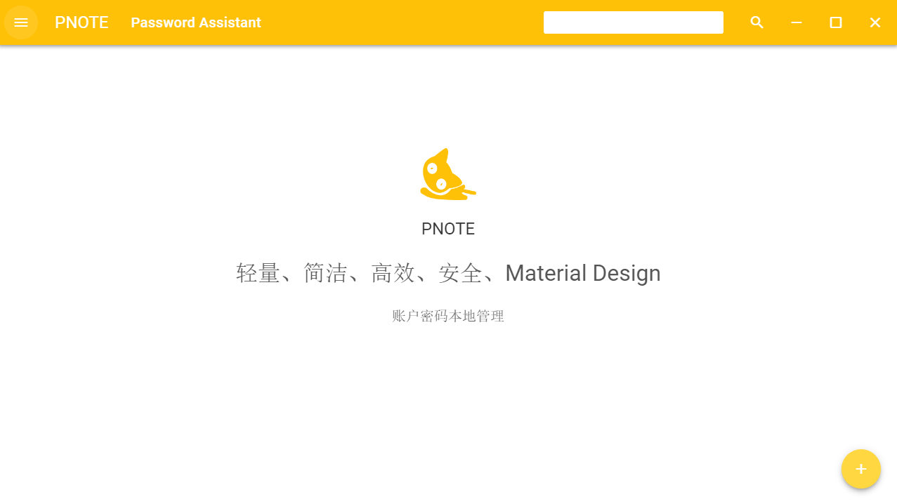

# PNOTE  本地账号密码存储工具

### 使用技术

UI：VUE + MDUI
存储：localStorage
打包：electron

### 构建部署（仅windows环境）

	1.安装node 环境（不会的话，方法自行百度）
	2.安装 electron  
		全局安装：npm install -g electron
		目录安装（推荐,好处是这种安装模式下，就可以不同的应用使用不同的electron版本），进入项目的路径：npm install electron
	3.调试应用
		（1）如果是全局模式安装electron，执行终端命令：  electron .
		（2）如果是本地模式安装electron,首先 cd  到项目的安装目录   再执行：.\node_modules\.bin\electron .
	4.打包应用
		打包代码已经也在了package.json里了
		（1）直接执行 npm run packager   即可打包64位安装版本   生成目录在release目录下
		（2）直接执行 mpm run packager-32 即可打包32位安装版本 
		

### 效果图

